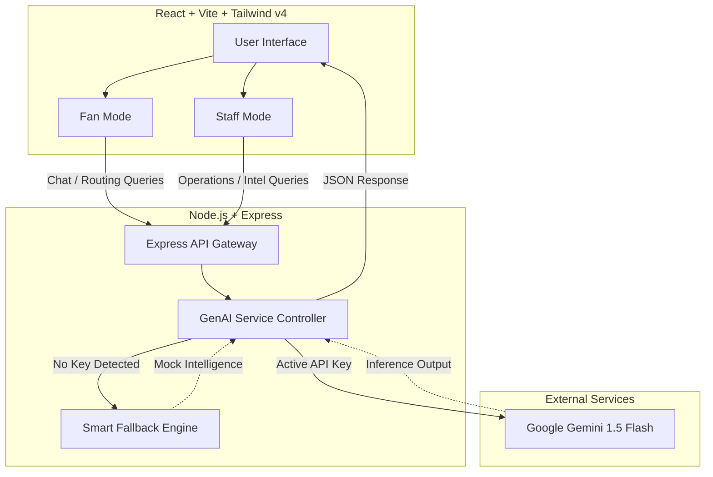
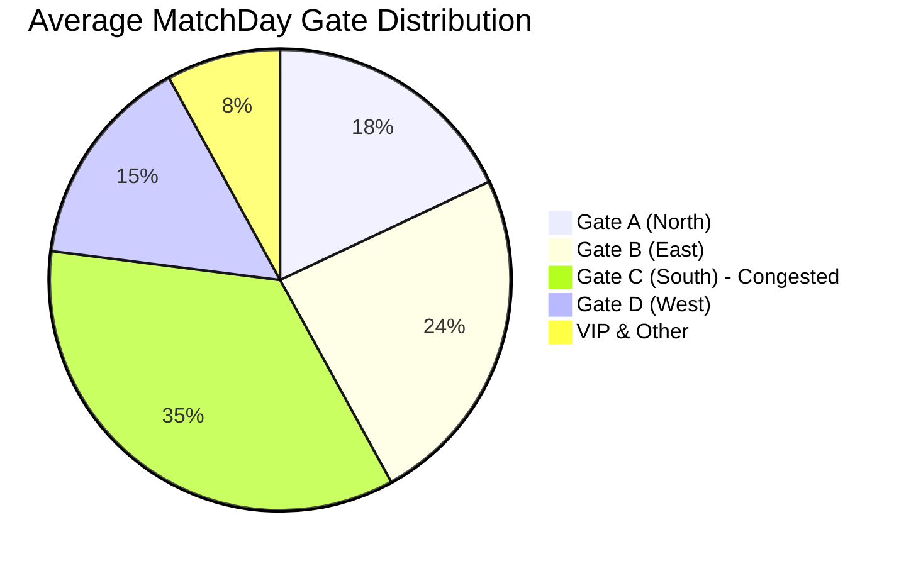
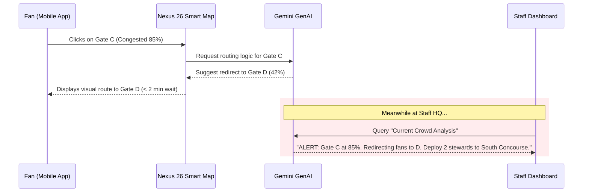

<div align="center">

  <h1>🏟️ Nexus 26</h1>
  <p><b>Intelligent Stadium Operations & Fan Experience Platform for FIFA World Cup 2026</b></p>

  <p>
    
    
    
    
    
  </p>
  
  <p><i>Nexus 26 is a GenAI-powered dual-interface platform that seamlessly connects stadium staff and global fans through real-time operational intelligence, multi-lingual assistance, and dynamic crowd management.</i></p>

</div>

---

## ✨ Key Features

### 👤 Fan Experience Mode
* **Multilingual GenAI Assistant:** Instant, context-aware help in 7+ languages powered by Google Gemini 1.5 Flash.
* **Interactive Smart Map:** Live SVG stadium mapping with real-time zone density and AI-suggested gate routing.
* **AI Transport Hub:** Live transport options (Shuttles, Metro, Walking) with dynamic crowd levels and AI recommendations.
* **Live Match Intelligence:** Real-time scores, schedules, and stadium statuses updated instantly.

### 🛡️ Staff Operations HQ
* **Live Crowd Density Monitoring:** Visual progress trackers with trend arrows for all stadium gates.
* **Incident Alert System:** Color-coded priority alerts (Critical, Warning, Info) for rapid response deployment.
* **Operational AI Insights:** One-click GenAI analysis of traffic flow, food court loads, and crowd bottlenecks.
* **Sustainability Tracker:** Real-time metrics on waste recycling, renewable energy, and carbon offsets.

---

## 🏗️ System Architecture

Nexus 26 operates on a decoupled Client-Server architecture utilizing a RESTful GenAI Bridge.



---

## 📊 Crowd Routing & Density Logic

The platform dynamically calculates crowd limits and wait times to safely route millions of fans.





---

## 🚀 Getting Started

### Prerequisites
* Node.js v18+
* npm or yarn
* [Google Gemini API Key](https://aistudio.google.com/app/apikey) (Free)

### Installation

1. **Clone the repository**
   ```bash
   git clone https://github.com/PrianshuKumarSahu/fifa26-smart-assist.git
   cd fifa26-smart-assist
   ```

2. **Setup the Backend**
   ```bash
   cd backend
   npm install
   
   # Add your Gemini API Key
   # Open .env and replace YOUR_GEMINI_API_KEY_HERE with your real key
   
   # Start the backend server (runs on Port 3001)
   npm run dev
   ```

3. **Setup the Frontend**
   ```bash
   # In a new terminal
   cd frontend
   npm install
   
   # Start the Vite development server
   npm run dev
   ```

4. **Open the App**
   Navigate to `http://localhost:5174` in your browser.

---

## 🎨 UI/UX Design System

Nexus 26 employs a **Premium Dark Glassmorphic Aesthetic** designed to look cutting-edge while remaining highly accessible.

* **Primary Palette:** Emerald Green `#00e676` (representing the pitch), Cyan `#00d4ff` (AI elements), and FIFA Gold `#ffbe0b`.
* **Typography:** `Orbitron` for futuristic numerics and dynamic data; `Rajdhani` for highly legible, dense operational text.
* **Micro-animations:** Glow pulses, smooth width transitions on data bars, and shimmer loading states ensure the interface feels alive and responsive.

<div align="center">
  <br/>
  <i>Built for the Future of Football ⚽</i>
</div>
